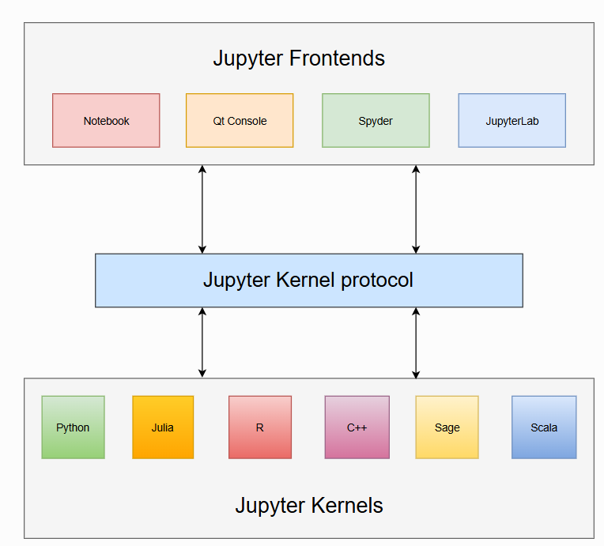

# `xeus` 使用方法

`xeus` 使自定义内核作者能够更轻松地实现 Jupyter 内核。它承担了实现 Jupyter 内核协议的负担，使开发者可以专注于实现内核的解释器部分。

- `interpreter` 指的是内核中负责执行代码、完成代码等部分。
- `client` 指的是 Jupyter 客户端，可以是 Jupyter Notebook/JupyterLab/Jupyter console 等。
- `user` 指的是在任何 Jupyter 客户端上使用内核的人。

开始使用新内核最简单的方法是创建继承自基本解释器类 `xeus::xinterpreter` 的类，并实现私有的虚拟方法。详情见：[usage](https://xeus.readthedocs.io/en/latest/usage.html)。

基于 `xeus` 的真实内核实现：
-  [`xeus-cling`](https://github.com/jupyter-xeus/xeus-cling): C++内核（`mamba install xeus-cling -c conda-forge`）
- [`xeus-python`](https://github.com/jupyter-xeus/xeus-python): Python 内核
